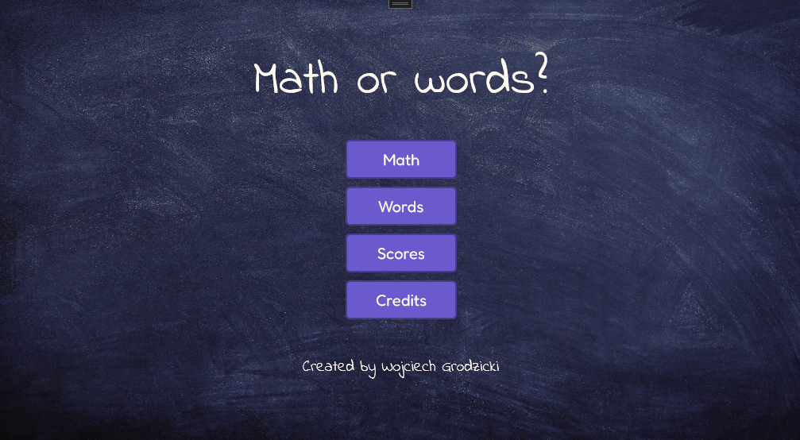
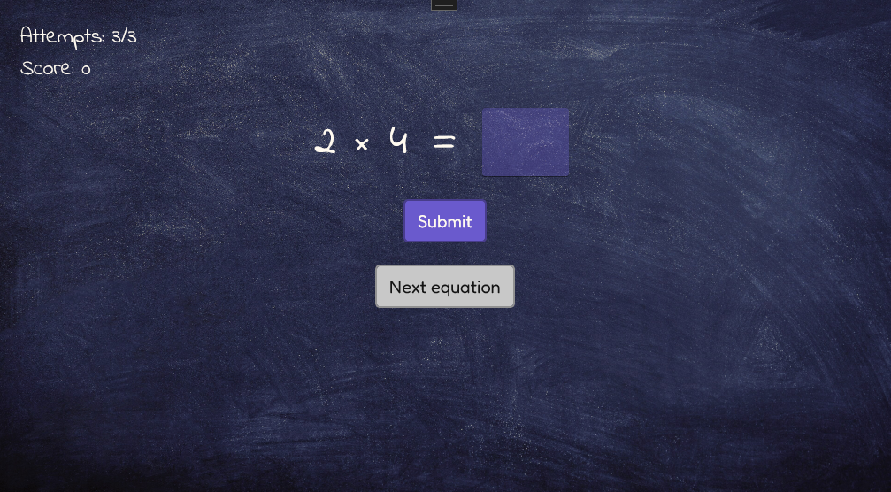
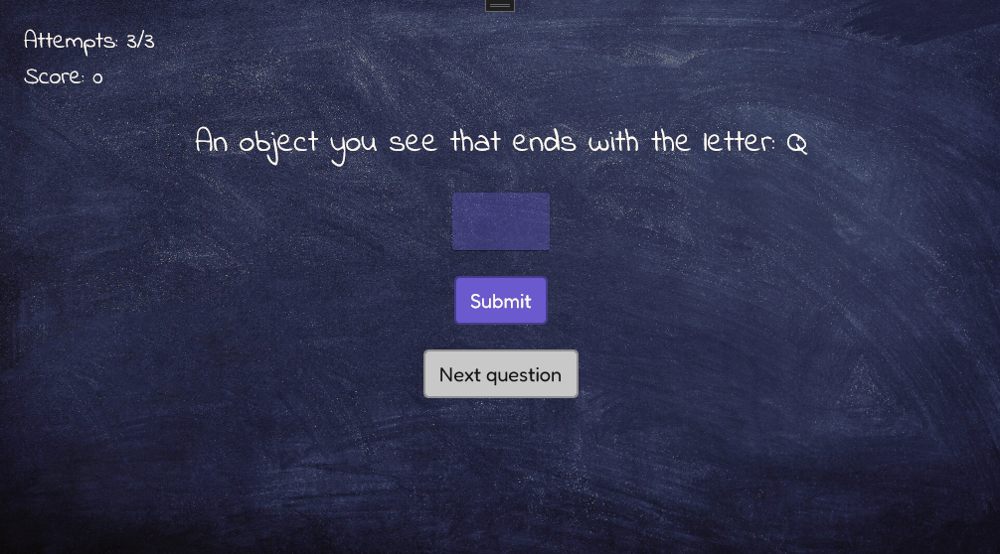

# **Math or Words**

This is "Math or Words", my first project made with .NET MAUI. It's a desktop application for Windows that lets you play a game to test your skills with either math or words. You can download a sideloading version of the app (Windows build) [here](https://www.dropbox.com/scl/fi/lpor306bu64rqtbym87j9/MathOrWords.7z?rlkey=n0jwjmqltppod5t2p7yam0dn7&dl=0).

## **Technical side of things**

The application is written with C# and XAML, using the .NET MAUI framework and SQLite for database management.

## **Features**

#### Math mode

Math mode consists in solving randomly generated equations (addition, subtraction, multiplication, division).

#### Words mode

Words mode consists in forming words within the given constraints (inclusion/exclusion of letters, specific letter at the beginning/at the end of the word).

In addition I also implemented:

- score and attempts counter
- score saving and browsing
- option to delete selected scores

## **How to play?**

Choose game mode (math or words) and game variant (in the case of math). Then try to solve the given equation (math) or find a word that matches the given constraints (words). You have 3 attempts each time you start a new game. Head to the scores page in order to browse your previous scores.

## **Main challenges**

When designing and implementing the project I stumbled upon several challenges:

- _MAUI framework_. It was my first encounter with the .NET MAUI framework and XAML, so it took me a while to get a grasp of the project structure and how the pages work with the code-behind pattern.

- _Database_. Previously I dealt mostly with raw SQL, so carrying out queries purely with C# and mapping a table to a class was something new to me. I also struggled a bit with finding a proper way to indicate the target folder to store the database.

- _Timed events_. I wanted to implement a slight "suspension" when the game was over and first thought of a simple timer. But then I found out about async methods and tasks, so I finally opted for a Delay() method without stopping the whole app, which was a good solution to the problem.

- _App deployment_. I have some previous experience with WPF, which allows to build and deploy straightaway from Visual Studio. In MAUI, however, it didn't work this way and I had to manually disable default packaging to be able to deploy and run the final app on my machine without any additional actions.

## **Credits**

- Basic code structure and techniques by [The C# Academy](https://www.youtube.com/watch?v=o81wpRuOGjE&list=PL4G0MUH8YWiAMypwveH2LlLK_o8Jto9CE)
- Fredoka font by Milena Brandão, Hafontia via [Google Fonts](https://fonts.google.com/specimen/Fredoka)
- Indie Flower font by Kimberly Geswein via [Google Fonts](https://fonts.google.com/specimen/Indie+Flower)
- Background by stux via [Pixabay](https://pixabay.com/photos/black-board-traces-of-chalk-school-1072366/)
- Trash bin icon by cybertotte via [Pixabay](https://pixabay.com/vectors/dust-bin-icon-the-trash-can-debris-4875414/)
